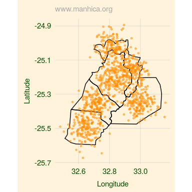
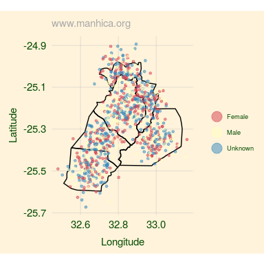

<!-- README.md is generated from README.Rmd. Please edit that file -->
cism: The R package of the Centro de Investigação em Saude de Manhiça
=====================================================================

Installation
------------

``` r
if(!require(devtools)) install.packages("devtools")
install_github('joebrew/cism')
```

About
-----

`cism`, the R package of the Centro de Investigação em Saude de Manhiça, is a collaborative effort to improve the way that CISM researchers interact with and utilize data.

Objectives
----------

The objectives of the R CISM package are simple:

1.  Make retrieving data more simple.

2.  Make data analysis more reproducible.

3.  Make interaction with data more pleasurable and beautiful.

Set up
------

Before using the `cism` package, you'll need to (1) install and (2) configure credentials.

### 1. Install

To use the `cism` package, you'll first need to install it. With a good internet connection, run the following from within R.

``` r
if(!require(devtools)) install.packages("devtools")
install_github('joebrew/cism')
```

Once you've installed the package, you can use its functionality in any R script by simply including the following line:

``` r
library(cism)
```

### 2. Configure credentials

Accessing CISM databases requires permissions. All the functionality in the `cism` package can be used by calling functions with a user's credentials. However, both for the sake of ease as well as to avoid putting any confidential information into R code, it is highly recommended to create a `credentials` folder with a `credentials.yaml` file. The contents of this file should look something like this:

    dbname: openhds
    host: sap.manhica.net
    port: 3306 # Use 4706 from outside of the CISM
    user: your_user_name
    password: your_pass_word

In the above, consider replacing `dbname` with the database you most often use. Replace `port` with 4706 if you work outside of the CISM. And replace the `user` and `password` fields with your name and password. If you use git, or any other form of version control, ensure that the `credentials.yaml` file is ignored by any repository viewable by others.

The `credentials/credentials.yaml` will be automatically detected by the `cism` package if in the same directory as the working directory, or if it is in a higher directory. Therefore, one should either create a `credentials/credentials.yaml` for each project, or place one `credentials/credentials.yaml` into a higher-level folder (for example "My Documents" for Windows users, or "/home/" for Linux users), under which all code resides.

Basic use
---------

### Retrieving data from CISM databases

With the `cism` package, getting data is simple. Assuming you've got a `credentials/credentials.yaml` in or above your working directory, you can simply point the `get_data` function at the database and table of your choice:

``` r
residency <- get_data(tab = 'residency', dbname = 'openhds')
```

The above will return the entire "residency" table from the "openhds" database.

If you're a more advanced user and want to filter, select or join directly in SQL before collecting the results into memory, you can write directly in SQL:

``` r
small_residency <- get_data(query = "SELECT uuid, startDate FROM residency limit 10", dbname = 'openhds')
```

### Visualizing data

The `cism` package offers several tools for the visualization of data.

#### cism\_plot

`cism_plot` is a simple wrapper for plotting a variable of any type, or 2 numeric variables. Its use is relatively straightforward.

We'll start by creating some fake data.

``` r
library(sp)
library(cism)
# Create a fake dataset of people
people <- data.frame(id = 1:1000,
                     sex = sample(c('Male', 'Female', 'Unknown'),
                                  size = 1000,
                                  replace = TRUE),
                     latitude = rnorm(mean = coordinates(man3)[,2],
                                      sd = 0.05,
                                      n = 1000),
                     longitude = rnorm(mean = coordinates(man3)[,1],
                                       sd = 0.05,
                                       n = 1000),
                     age = sample(seq(22, 
                                      26,
                                      length = 10000), 
                                  size = 1000, replace = TRUE),
                     money = sample(seq(0,
                                        100000,
                                        length = 1000000), size = 1000, replace = TRUE))
```

`cism_plot` intuitively handles the visualization of counts of categorical data:

``` r
cism_plot(x = people$sex)
```


It also handles numeric variables.

``` r
cism_plot(x = people$age)
```


If explicitly told to, it will treat a numeric variable as a categorical.

``` r
cism_plot(x = round(people$age), type = 'factor')
```


Finally, if given two (numeric) variables, CISM plot will generate a simple x-y chart.

``` r
cism_plot(x = people$age,
          y = people$money)
```


#### cism\_map

Like `cism_plot`, `cism_map` strives to generate useful and aesthetically pleasing maps with the least amount of input necessary. In the below examples, we'll use the `people` dataset we generated above.

At its most simple level, `cism_map` can show the location of longitude and latitude.

``` r
cism_map(lng = people$longitude,
         lat = people$latitude)
```


By providing a "fortified SpatialPolygonsDataFrame" (of which several come with the `cism` package), the map will get adminsitrative outlines for the relevant areas.

``` r
cism_map(lng = people$longitude,
         lat = people$latitude,
         fspdf = man3_fortified)
```



If we want to see our points colored by a categorical variable, we simply indicate the variable in our call to `cism_map`.

``` r
cism_map(lng = people$longitude,
         lat = people$latitude,
         fspdf = man3_fortified,
         x = people$sex)
```



By the same token, points can also be colored by a continuous variable.

``` r
cism_map(lng = people$longitude,
         lat = people$latitude,
         fspdf = man3_fortified,
         x = people$money)
```


As with other ggplot objects, plots generated by `cism_map` or `cism_plot` can be given further modifications through additional calls to ggplot2 functions. For example:

``` r
cism_map(lng = people$longitude,
         lat = people$latitude,
         fspdf = man2_fortified,
         x = people$sex) +
  ggtitle('Spatial distribution by sex')
```


#### cism\_map\_interactive

`cism_map_interactive` is very similar to `cism_map`. Rather than build static maps, it builds interactive satellite-based maps.

To use, you'll need a dataset with at least longitude and latitude. Here we'll again use our `people` dataset:

``` r
cism_map_interactive(lng = people$longitude, 
                     lat = people$latitude)
```


We can add a SpatialPolygonsDataFrame, including those included in the cism package, with the `spdf` arugment.

``` r
cism_map_interactive(lng = people$longitude, 
                     lat = people$latitude, 
                     spdf = man3)
```


Our points can be simple representations of location (above), or we can color them by a categorical variable.

``` r
cism_map_interactive(lng = people$longitude,
                     lat = people$latitude,
                     spdf = man2,
                     x = people$sex)
```


Rather than a categorical variable (above), we can also color points by a continous variable.

``` r
cism_map_interactive(lng = people$longitude,
                     lat = people$latitude,
                     spdf = man2,
                     x = people$age)
```


Finally, the `popup` argument can be used to indicate what text should be shown when an icon is clicked.

``` r
cism_map_interactive(lng = people$longitude,
                     lat = people$latitude,
                     spdf = man2,
                     x = people$age,
                     popup = people$sex)
```


### Built-in datasets

The `cism` package also includes several built-in datasets. These are as follows.

#### Spatial data

The names "moz", "man", and "mag" signify "Mozambique", "Manhiça", and "Magude" (respectively). The number therafter signifies the administrative level (0 = country, 1 = province, 2 = district, 3 = sub-district). The suffix "\_fortified" means that the object is in a "fortified" (ie, ggplot2-compatible) dataframe format; objects without this suffix are SpatialPolygonsDataFrames.

Built-in datasets in the `cism` package are "lazily" loaded, mean that you can call them at any point after attaching the `cism` package by simply using their name. For example:

``` r
library(cism)
plot(moz2)
```


The above plots the SpatialPolygonsDataFrame of Mozambique at the 2nd administrative level (ie, district).

By the same token, I could also run the following to get a map of the Magude district at the third administrative level using the ggplot framework for plotting:

``` r
library(ggplot2)
library(cism)

ggplot() +
  geom_polygon(data = mag3_fortified,
               aes(x = long,
                   y = lat,
                   fill = id)) +
  coord_map()
```


#### Manipulating spatial data

The `cism` package has a function, `ll_from_utm`, for the conversion of UTM (Universal Transverse Mercator) coordinates to longitude and latitude. Its use is as follows:

``` r
# Create a dataset of some UTM coordinates
fake_data <- data_frame(id = 1:5,
                        x = c(480132,
                              481126,
                              481316,
                              478351,
                              478172),
                        y = c(7192161,
                              7192833,
                              7190708,
                              7189107,
                              7189615))
# Convert to latitude and longitude
converted <- ll_from_utm(x = fake_data[,c('x', 'y')],
                         zone = 36)
# See converted data
head(converted)
#> # A tibble: 5 x 2
#>          x         y
#>      <dbl>     <dbl>
#> 1 32.80249 -25.38721
#> 2 32.81238 -25.38116
#> 3 32.81424 -25.40035
#> 4 32.78473 -25.41477
#> 5 32.78296 -25.41018
# Plot converted data
cism_map_interactive(lng = converted$x,
                     lat = converted$y,
                     point_size = 10)
#> Removing 0 observations of a total 5. 0%.
```


#### Dataframes

The `cism` package also includes non-spatial data. The World Bank's "World Development Indicators" time series data is included for Mozambique in a (plot-friendly) long format. Here's an example of how to use.

``` r
# Attach cism package
library(cism)

# Bring wb (world bank) data into memory
wb <- wb

# Look at it
head(wb)
#> # A tibble: 6 x 6
#>      country country_code
#>        <chr>        <chr>
#> 1 Mozambique          MOZ
#> 2 Mozambique          MOZ
#> 3 Mozambique          MOZ
#> 4 Mozambique          MOZ
#> 5 Mozambique          MOZ
#> 6 Mozambique          MOZ
#> # ... with 4 more variables: indicator_name <chr>, indicator_code <chr>,
#> #   year <dbl>, value <dbl>

# Subset for only the homicide rate over time
homicides <- 
  wb %>%
  filter(indicator_name == 'Intentional homicides (per 100,000 people)') %>%
  filter(!is.na(value))

# Visualize
cism_plot(x = homicides$year,
          y = homicides$value,
          trend = TRUE) +
  labs(x = 'Year',
       y = 'Rate per 100,000',
       title = 'Homicide rate in Mozambique',
       subtitle = 'According to the World Bank')
#> `geom_smooth()` using method = 'loess'
```


There are 1308 development indicators in the dataset. These can be explored below.

``` r
DT::datatable(data_frame(`Indicator name` = sort(unique(wb$indicator_name))))
```


The `cism` package also includes the location (as well as some supplementary data) of all government health facilities ("unidades sanitarias") in Mozambique. This dataset, named `us`, can be called by running the following:

``` r
us <- cism::us
```

The data is in the following format:

| province     | district        | name                |  number| administrative\_pst | locality                | area   | classification      | type                   | level           |   latitude|  longitude|
|:-------------|:----------------|:--------------------|-------:|:--------------------|:------------------------|:-------|:--------------------|:-----------------------|:----------------|----------:|----------:|
| CABO DELGADO | CIDADE DE PEMBA | HP Pemba            |     148| CIDADE DE PEMBA     | CIDADE DE PEMBA         | URBANA | Hospital Provincial | Hospital Provincial    | Nivel Terciario |  -12.96580|   40.49530|
| CABO DELGADO | CIDADE DE PEMBA | CS Cariaco          |     149| CIDADE DE PEMBA     | BAIRRO CARIACO          | URBANA | Centro de Saude     | Centro de Saude Urbano | Nivel Primario  |  -12.96310|   40.51720|
| CABO DELGADO | CIDADE DE PEMBA | CS Ingoname         |     150| CIDADE DE PEMBA     | BAIRRO NATITE           | URBANA | Centro de Saude     | Centro de Saude Urbano | Nivel Primario  |  -12.96110|   40.50710|
| CABO DELGADO | CIDADE DE PEMBA | CS Natite           |     151| CIDADE DE PEMBA     | BAIRRO NATITE           | URBANA | Centro de Saude     | Centro de Saude Urbano | Nivel Primario  |  -12.96190|   40.50890|
| CABO DELGADO | CIDADE DE PEMBA | CS Bairro Cimento   |     152| CIDADE DE PEMBA     | BAIRRO NATITE           | URBANA | Centro de Saude     | Centro de Saude Urbano | Nivel Primario  |  -12.96106|   40.50715|
| CABO DELGADO | CIDADE DE PEMBA | CS Eduardo Mondlane |     153| CIDADE DE PEMBA     | BAIRRO EDUARDO MONDLANE | URBANA | Centro de Saude     | Centro de Saude Urbano | Nivel Primario  |  -12.97110|   40.55330|

The locations can be visualized as such:

``` r
library(ggplot2)
library(cism)
cism::cism_map(lng = us$longitude,
               lat = us$latitude,
               fspdf = cism::moz1,
               opacity = 0.8,
               point_size = 0.5) +
  labs(title = 'Health facilities')
```


### Aesthetic tweaks

#### Theme

The `cism` plot comes with the `theme_cism` function, which can be appended to any ggplot2-style plot to make it more aesthetically compatible with the CISM's color scheme. For example, rather than

``` r
ggplot(data = people,
       aes(x = sex)) +
  geom_bar()
```


We can instead run

``` r
ggplot(data = people,
       aes(x = sex)) +
  geom_bar(fill = 'darkorange', color = 'darkgreen') +
  theme_cism()
```


#### Branding

We can also "brand" a plot, by running `brand_cism()`, which will add the website to the subtitle of the plot:

``` r
ggplot(data = people,
       aes(x = sex)) +
  geom_bar() +
  geom_bar(fill = 'darkorange', color = 'darkgreen') +
  theme_cism() +
  brand_cism()
```


Both `theme_cism` and `brand_cism` work on maps as well:

``` r
ggplot() +
  geom_polygon(data = mag3_fortified,
               aes(x = long,
                   y = lat,
                   fill = id)) +
  coord_map() +
  theme_cism() +
  brand_cism()
```


Advanced use
------------

### Fuzzy string-matching

It is often the case that datasets must be merged by name. This is problematic when one name is written slightly differently in one dataset than in another (for example, "Esmeralda" and "Esmerelda"). The function `fuzzy_match` employs the Jaro-Winkler distance algorithm to generate a "distance matrix" which shows how similar one name is to another (0 being identical, 1 being totally different).

The below shows an example of its use.

``` r
# Define a list of names
x <- c('joe', 'joseph', 'coloma', 'ramona', 'paloma', 'ramon', 'elena', 'beatriz')
# Define another list of names (with which we're going to match)
y <- c('helena', 'bea', 'jeo', 'joe', 'colombia', 'romania')
# Perform the matching
results <- fuzzy_match(x = x, y = y)
# View results
results
#>          y
#> x             helena       bea       jeo       joe   colombia   romania
#>   joe     0.50000000 1.0000000 0.4444444 0.0000000 0.51388889 0.5079365
#>   joseph  0.55555556 0.5000000 0.2777778 0.1666667 0.56944444 0.5634921
#>   coloma  0.44444444 1.0000000 0.5000000 0.5000000 0.08333333 0.3571429
#>   ramona  0.44444444 0.5000000 0.5000000 0.5000000 0.48611111 0.1031746
#>   paloma  0.44444444 0.5000000 0.5000000 0.5000000 0.36111111 0.3789683
#>   ramon   0.54444444 0.4888889 0.4888889 1.0000000 0.61666667 0.1619048
#>   elena   0.05555556 0.4888889 0.4888889 0.4888889 0.45000000 0.6047619
#>   beatriz 0.56349206 0.1904762 0.5079365 0.5079365 0.57738095 0.4761905
```

Note that the algorithm performs well. The name "bea" has very few matches, but is most closely matched to "beatriz". The name "joe" has an exact match (ie, a score of 0), but also gets an approximate match (ie, low score) for the name "joseph". "elena" is closely matched with "helena", and equally far (ie, high score) from names like "joe" and "bea".

We can visualize the results as well:

``` r
# Reshape for plotting
plot_data <- data.frame(results) %>%
  mutate(x = row.names(results)) %>%
  gather(y, score, helena:romania)
# Visualize results
ggplot(data = plot_data,
       aes(x = x,
           y = y,
           fill = score)) +
  geom_tile() +
  scale_fill_gradient2(name = 'Distance',
                       low = 'darkgreen',
                       mid = 'white',
                       high = 'darkorange',
                       midpoint = 0.5) +
  theme_cism() +
  labs(title = 'Fuzzy matching results',
       subtitle = 'Using the CISM fuzzy_match function') +
  theme(axis.text.x = element_text(angle = 90))
```


### Bibliography management

The `doi_to_bib` function generates a `bibtex` format bibliography entry (ready for use by bibliographic management software or for use in `.bib` file when used with Rmarkdown). The process is simple.

1.  Find an article you wish to cite such as [this one](https://www.ncbi.nlm.nih.gov/pubmed/28819225).

2.  Copy the `doi` from the article (usually at the top). In this case, it is `10.1038/s41598-017-08906-x`.


1.  Run the following code.

``` r
doi_to_bib('10.1038/s41598-017-08906-x')
```

And you'll get the following output, ready to copy-paste into your bibliography management software or directly into your `.bib` file if using Rmarkdown.

    #>  @article{Chaccour_2017, 
    #> title={Cytochrome P450/ABC transporter inhibition simultaneously enhances ivermectin pharmacokinetics in the mammal host and pharmacodynamics in Anopheles gambiae         },
    #>  volume={7},
    #>  ISSN={2045-2322},
    #>  url={https://doi.org/10.1038/s41598-017-08906-x},
    #>  DOI={10.1038/s41598-017-08906-x},
    #>  number={1},
    #>  journal={Scientific Reports},
    #>  publisher={Springer Nature},
    #>  author={Chaccour, Carlos J. and Hammann, Felix and Alustiza, Marta and Castejon, Sandra and Tarimo, Brian B. and Abizanda, Gloria and Irigoyen Barrio, Ángel and Martí Soler, Helena and Moncada, Rafael and Bilbao, José Ignacio and et al.},
    #>  year={2017},
    #>  month={Aug}}
